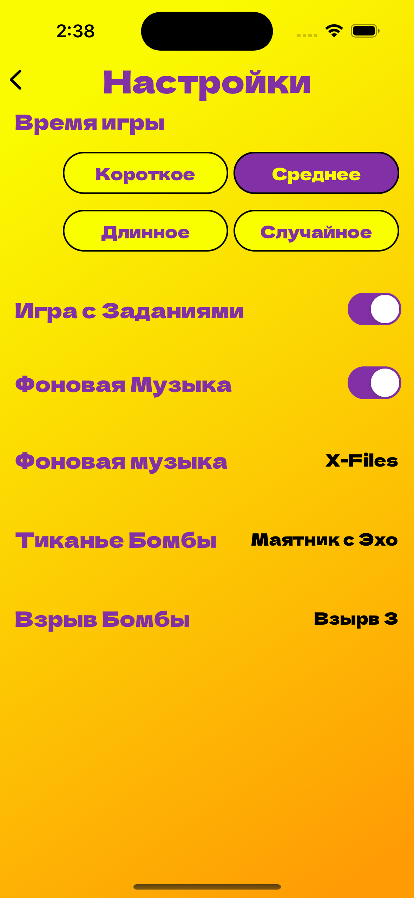
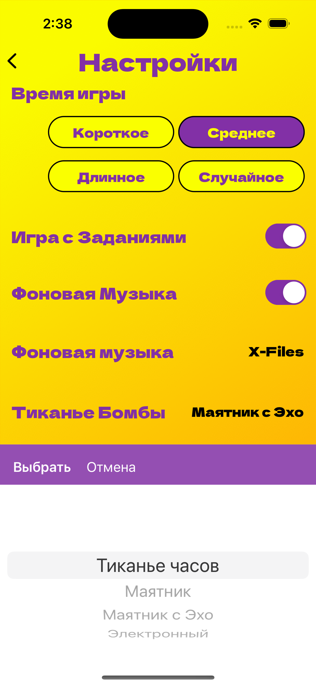

# BOMB-app   

> Bomba is a fun game that will brighten up any party! Answer the questions together with your friends until the bomb explodes. The loser performs the tasks
____
This project was implemented as part of the [Swift-Marathon 8.0](https://boosty.to/swiftmarathon)   

# Our team:

TeamLead - [Ivan](https://github.com/Ivan-Biriukov) 

Members:

- [Ilyas](https://github.com/TyumenevIF)

- [Islam](https://github.com/Morganzy9)

- [Elizaveta](https://github.com/Eremyonok)

- [Caroline](https://github.com/CarolineTV) 
____

### As part of this challenge [project design](https://www.figma.com/community/file/1267859220936385331) was provided and tasks were assigned:

### Home Screen

- On the Home Screen, you need to add a picture of a bomb and four buttons:
    - "New Game" which takes you to the Game Screen
    - "Categories" - which takes you to the Category Selection Screen
    - "Rules" - which leads to the RulesScrollView, where the rules of the game should be described

 ### Game screen

- At the beginning of a new game, there is a "Start" button, a label with the text "Click start to start the game" and a bomb, once the game starts, the round starts
- The screen should display a bomb and a question. The questions should be questions that can be answered many times. For example: "What is the make of the car?" or "What is the letter A of the country?"
- Add a bomb animation, choose your favorite (below are suggested sources)
- Background music and fuse sound should be played during the round, music can be found on the following website:
- There must be a pause button to stop the timer and a button to return to the main menu
- The bomb should explode 30 seconds after the game starts
- After the bomb explodes, an explosion sound is made, a random punishment is displayed (list of at least 10 punishments), there should also be a "another punishment" button and a "start again" button

### Categories screen

- The CategoryViewController should display a minimum of 4 categories of questions (more if desired), e.g. Sports / Hobbies / Personalities / Nature etc.
- Each category should have at least 15 questions that appear randomly on the Game Screen without repeating themselves

### Settings screen

- Add a "SettingsViewController" button to the main screen where there are options:
    - Game Time:
        - Short (10 seconds)
        - Medium (20 seconds)
        - Long (45 seconds)
        - Random (10 to 45)
    - Ability to change sounds in the game:
        - Background music (3 variants)
        - Bomb ticking (3 variants)
        - Bomb Explosion (3 variants)
    - Ability to disable and enable the following features:
        - Background music in the game
        - Tasks after the bomb explodes

### Game screen

- Add a "Continue" button to the main screen, which will start the game from where the user left off (even after the application has been unloaded from RAM). Saving can be implemented via UserDefaults

### Rules screen

- Add RulesViewController (you can see more specifically on the figma)

____
# Common project info:
- Application language - Swift 5
- Minimum Deployment - iOS 15
- Device Orientation - Portraiеt
- Design Pattern - MVC

____
# What we have created:

<h3 align="center"> Launch Screen

  

<h3 align="center"> MainScreen

  
    

<h3 align="center"> Coose Questions Categoryes Screen

  
  

<h3 align="center"> Rules Screen

  
  
    

<h3 align="center"> Game Processing Screens

  
  
  
  

<h3 align="center"> Game Settings Screen

  
  

